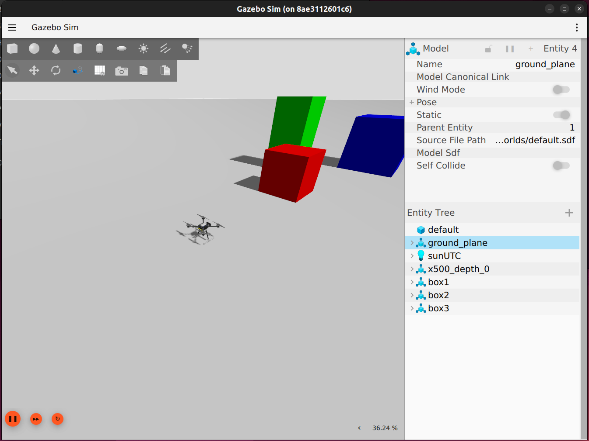
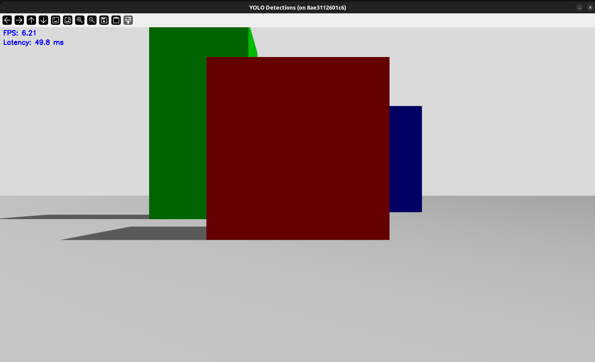

Alessandra Gorini

The link to my github repository : https://github.com/aless-grn/lecture8-perception

# Aufgabe 1 – Object Detection with YOLO

## Overview

This project implements a perception pipeline using ROS 2 and Gazebo.
The objective is to process a simulated RGB camera stream, perform object detection using a pretrained YOLO model, and publish the results through a custom ROS 2 message.

The system is integrated with a PX4 SITL simulation and uses Gazebo for the environment.

---

## Environment

* Ubuntu (Docker container)
* ROS 2 Jazzy
* Gazebo Harmonic
* PX4 SITL
* MAVROS
* Python 3.12
* Ultralytics YOLOv8

---

## Repository Structure

```
workspace/
├── src/
│   ├── perception_msgs/
│   └── perception_yolo/
├── images/
```

---

## Setup Instructions

### 1. Start Docker environment

```bash
cd /root/workspace
docker compose up -d
```

### 2. Launch PX4 + Gazebo (Terminal 1)

```bash
docker exec -it px4_sitl bash
cd /root/PX4-Autopilot
make px4_sitl gz_x500_depth
```

### 3. Start ROS–Gazebo bridge (Terminal 2)

```bash
cd /root/workspace
docker exec -it px4_sitl bash
ros2 run ros_gz_bridge parameter_bridge \
/world/default/model/x500_depth_0/link/camera_link/sensor/IMX214/camera_info@sensor_msgs/msg/CameraInfo@gz.msgs.CameraInfo \
/world/default/model/x500_depth_0/link/camera_link/sensor/IMX214/image@sensor_msgs/msg/Image@gz.msgs.Image \
/depth_camera@sensor_msgs/msg/Image@gz.msgs.Image \
/depth_camera/points@sensor_msgs/msg/PointCloud2@gz.msgs.PointCloudPacked \
--ros-args \
-r /world/default/model/x500_depth_0/link/camera_link/sensor/IMX214/camera_info:=/camera/color/camera_info \
-r /world/default/model/x500_depth_0/link/camera_link/sensor/IMX214/image:=/camera/color/image \
-r /depth_camera:=/camera/depth/image \
-r /depth_camera/points:=/camera/depth/points
```

### 4. Run MAVROS

```bash
cd /root/workspace
docker exec -it px4_sitl bash
ros2 launch mavros px4.launch fcu_url:=udp://:14540@localhost:14557
```

### 5. Build ROS workspace

```bash
cd /root/workspace
source /opt/ros/jazzy/setup.bash
colcon build
source install/setup.bash
```

### 6. Activate Python environment

I had to install the YOLO dependencies in a local virtual environment which are not included in the repository because it would be too big otherwise.
Create it with:

```bash
cd /root/workspace
python3 -m venv yolo_venv
source yolo_venv/bin/activate
pip install --upgrade pip
pip install ultralytics opencv-python "numpy<2"
```

---

## Running the YOLO Node

```bash
source /opt/ros/jazzy/setup.bash
source /root/workspace/install/setup.bash
python /root/workspace/src/perception_yolo/perception_yolo/yolo_detector.py
```

---

## Custom ROS 2 Messages

### Detection.msg

```
string class_name
float32 confidence
int32 x_min
int32 y_min
int32 x_max
int32 y_max
```

### DetectionArray.msg

```
std_msgs/Header header
Detection[] detections
```

The detection results are published on:

```
/detections
```

---

## Results

The system successfully:

* Subscribes to `/camera/color/image`
* Converts images using `cv_bridge`
* Runs YOLOv8 inference on each frame
* Displays the camera stream with OpenCV
* Publishes detection results as ROS 2 messages
* Computes FPS and latency in real time

### Gazebo Simulation



### YOLO Output



### Visualization

The output window shows:

* live camera feed
* FPS
* inference latency

---

## Note

The simulated environment contains simple coloredboxes. These objects are not part of the YOLO training dataset, therefore the model produces no detections.

---

## Performance

Approximate performance:

* FPS: 6–12
* Latency: 45–80 ms per frame

---

## Verification

Check detection topic:

```bash
ros2 topic echo /detections
```

Check camera topic:

```bash
ros2 topic echo /camera/color/image
```

---

## Problems

I had a lot of problems setting up the project which took me a lot of time to solve. I also  had to debug some problems with python and numpy in the container, because some packagescouldn't be installed and to use one package I had to have a less recent version of numpy.
